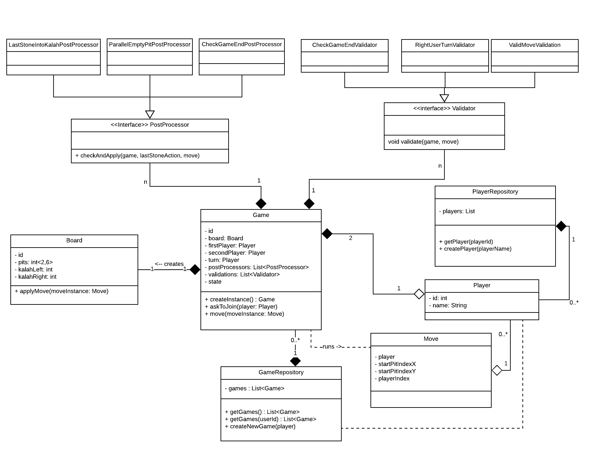

<b>KALAH(Mancala) game implementation</b>

This project is a basic implementation of "Kalah game". To know what it is and how it is played, check out the link:<a href="https://en.wikipedia.org/wiki/Kalah">https://en.wikipedia.org/wiki/Kalah</a> 

<b>DESIGN</b>:

Domain diagram illustrated below:

<b>USED TECHS/b>
<ul>
    <li>Java 8 as PL</>
    <li>Spring Boot 1.5.10 as web configs and Rest Services</li>
    <li>Swagger as API visualizer</li>
    <li>Spring Boot Test and JUnit for testing</li>
    <li>Lucid Chart for design illustration</li>
</ul>

<b>NOTE</b>

Unit/Integration tests are not 100% done. I tried to give samples for each of them in tests.
